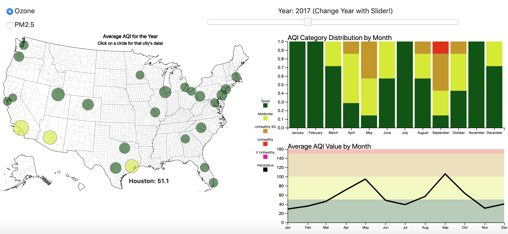

# Air Quality in the US (2015 to present)
### jpicca/airQualityViz
----
## Group 1
### Team members: 
* Audelia Torres
* Cenez Tindoc
* Joey Picca
* Joseph McManus
* Shane Gatenby
----
#### Data Source
* AirNow.gov API: https://docs.airnowapi.org/
  * Top 25 most populated Combined Statistical Areas in the United States
  * First 7 days of every month: Jan 2015 to Apr 2020
  
#### Screenshot of Dashboard

----
#### Key Files:
1) AirNow API: /AirNowAPI/AirNowAPI_v6.ipynb
    1) Top 25 Largest CSAs: /AirNowAPI/Resources/largest_combined_statistical_areas_t25.py
2) PostgreSQL Database Load: dbSetUp.ipynb
3) Flask App: app.py
4) Dashboard: 
    1) html: /web/index.html
    2) css: /web/style/style.css 
    3) javascript: /web/js/getData.js 
    3) javascript: /web/js/makeMap.js 
    3) javascript: /web/js/buildCharts.js 
    3) javascript: /web/js/interactions.js
5) Presentation: presentation.pptx

